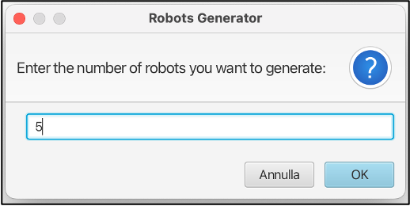
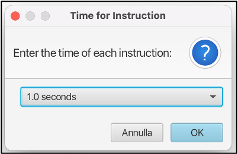
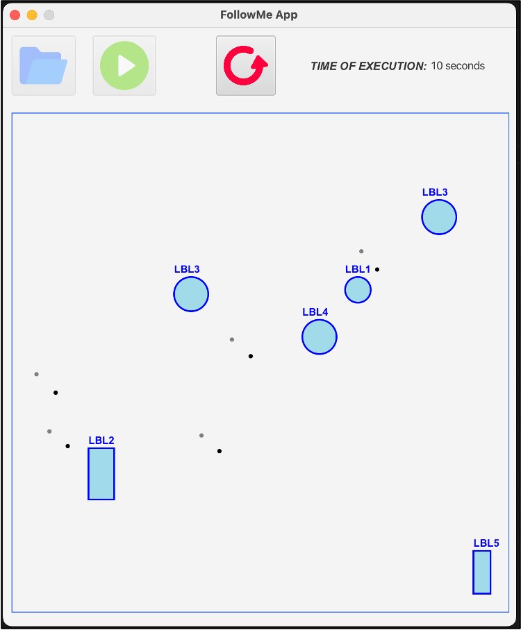

# FollowMe

**1. Introduction**

The “FollowMe” project is a Java application that offers the possibility of simulating a group of robots moving in a 
virtual space. This simulation is supported by a Java library specifically developed to manage the behavior of robots 
within the simulated environment. There is also an attached graphical interface that allows users to more clearly 
visualize the surrounding environment and the robots before and after running the program.

For the development of the project, I used Gradle as a build automation and dependency management system. Additionally, 
I found it appropriate to use Java SE 17 (LTS) and JavaFX in version 20.0.1. Choosing this version of Java will ensure 
long-term stability, as this version will be supported for an extended period of time.

**2. Assigned Responsibilities**

Before starting the development process, I outlined the objectives of the project which I then developed to clarify the 
specific features to be implemented and the key requirements. I defined the following responsibilities which I then 
developed in the specified classes:

- *Characteristics of robots and their behaviors:* Implemented by the `Robot` class that represents a robot in space and 
   specifies its movement and capabilities interaction.
- *Specification of possible commands within a program:* All classes representing basic commands implement the 
   `RobotCommand` interface (i.e., `MoveCommand`, `MoveRandomCommand`, `SignalCommand`, `UnsignalCommand`, 
   `FollowCommand`, `ContinueCommand`, `StopCommand`). Instead, the classes representing the selection and iteration 
   commands (`RepeatCommand`, `UntilCommand`, `DoForever`) extend the abstract `AbstractIterator` class which in turn 
   implements the `Iterator` interface. The latter is an extension of the `RobotCommand` interface.
- *Representation of the figures that make up the environment:* This responsibility is assigned to the `Circle` and 
   `Rectangle` classes. They extend the `GeometricShape` class which in turn implements the basic `Shape` interface. 
   These classes represent the possible figures present in the environments and implement some utility methods.
- *Execution flow management:* Therefore, the initialization of the application, the generation of the robots, the 
   loading of the environment and the program to be executed. These features are implemented in the `Referee`, it acts 
   as the application controller.
- *Compiling program and environment commands:* The parsing of the program and the loaded environment occurs in the 
   `Handler` class. It is a sort of compiler that verifies syntactic correctness, loads the environment and the program 
   to be executed. This class uses the `ShapeParser` utility class to parse the environment.
- *Program execution in the swarm:* Once loaded, the program is saved within the `Executor` class which takes care of 
   the correct execution of the program, also managing any nested loops. This class uses the `CommandExecutor` utility 
   class to execute individual commands.

For better data consistency I created the following classes which allow me to represent the various data types more 
specifically: `Point`, `Direction`, `Signal`. Furthermore, for better organization and management of responsibilities 
I also created some utility classes: `DirectionCalculator`, `DistanceCalculator`, `RandomPointGenerator`, `CommandRow`.

**3. Instructions for execution**

As already specified, the program created uses Gradle and Java. Therefore, to compile it, simply execute the command 
from the `gradle build` terminal and to execute it the `gradle run` command.

Once the run command has been executed you will get a window (*Figure 1*) in which you will first be asked for the 
number of robots that you want to generate randomly in the simulation. Subsequently, another window will appear 
(*Figure 2*) which will allow you to select the time to dedicate to the execution of each individual command.

***Figure 1:** Robots Generator window.*

***Figure2 2**: Time for Instruction window.*

Once the initial data has been entered correctly, a graphical interface will appear in which there are three buttons: 
the first button to load the environment file, the second button to load the program and run it, the third button allows 
you to restart the application to be able to do a new simulation.

At the end of the execution, the final configuration and the relative execution time will be displayed seconds of the 
program (*Figure 3*).

***Figure 3:** FollowMe App execution finished.*

Inside the file folder there are two files to be able to carry out a basic execution of the application:
- ./file/environmentProgram.rshp;
- ./file/robotProgram.rprg. 
